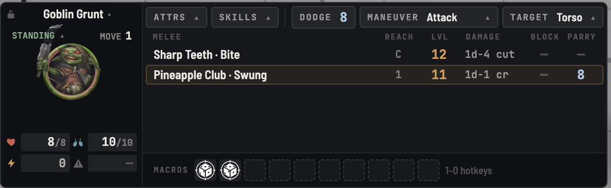
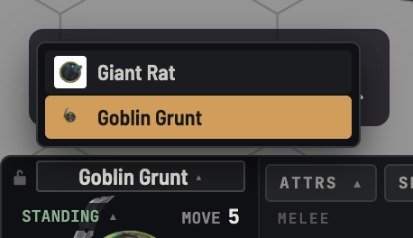
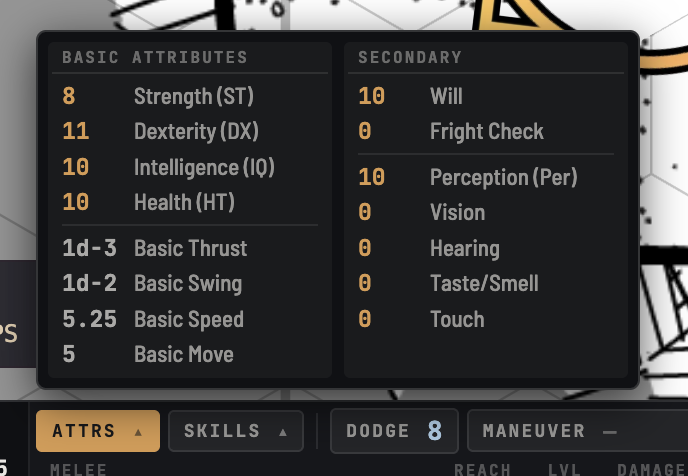
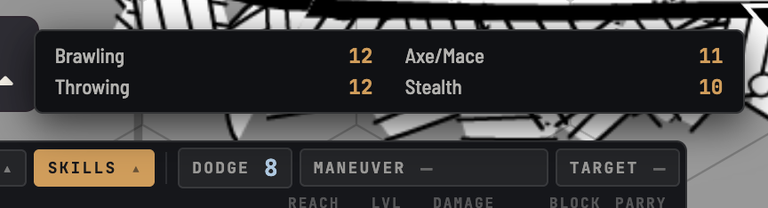
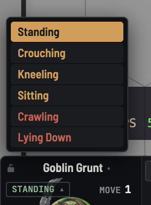
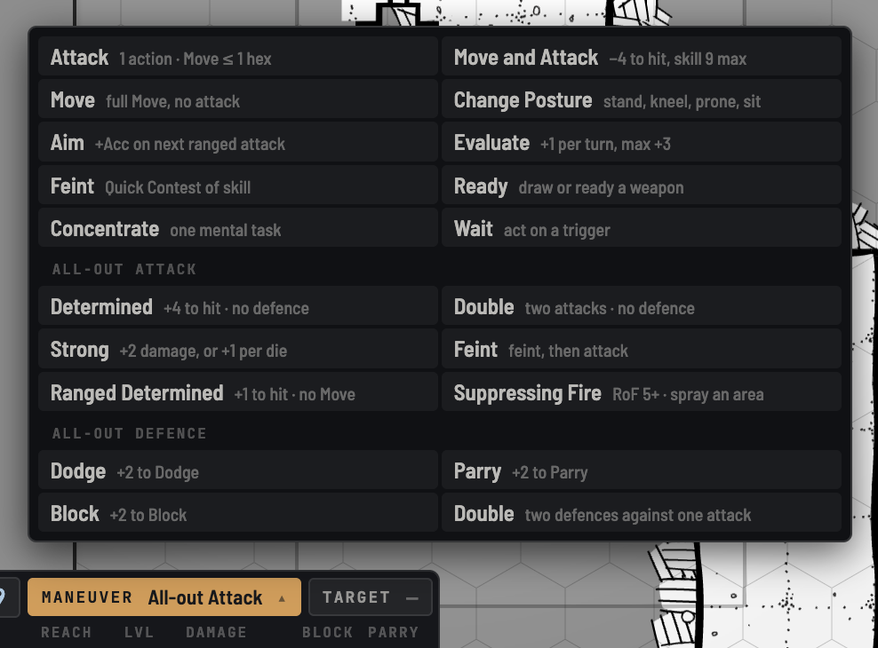
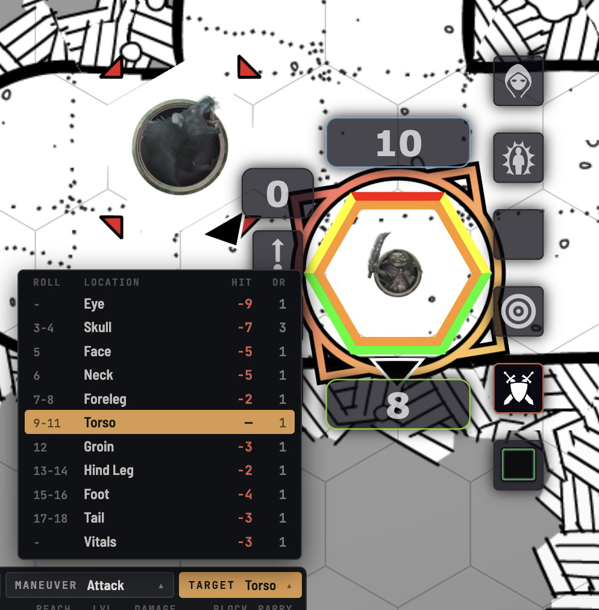

# GURPS HUD

A clean, concise heads-up display for playing [GURPS 4e](https://github.com/crnormand/gurps) in
Foundry VTT, inspired by [pf2e-hud](https://github.com/reonZ/pf2e-hud).



## Features

### Switching Characters

By default, selecting a token you can control switches it to that 
actor. Disable this behaviour by clicking the "lock" icon.

Hover the character name to reveal all the selectable actors. Click
on their name to switch.



### Always Available
#### Attributes



#### Skills

### 
#### Posture



### Combat

#### Choose Which Attacks Appear

A GURPS sheet lists every attack a character could conceivably make, which is far more than fits in
a strip you read at a glance. So the HUD starts empty and you say what belongs there: drag melee and
ranged rows off the character sheet onto the strip, or press **Add every attack** to take the lot and
prune from there.

Each row is gripped by the dotted handle on its left, the same one the character sheet uses. Drag it
to reorder the attack within its group, or off the HUD entirely to take it away — `Alt`+`↑`/`↓` and
`Delete` do the same from the keyboard. Attacks only ever move within their own group, and only the
strip's own character's attacks can be dropped on it.

The choice is stored on the actor, so it comes back for everyone at the table the next time that
character is selected.

#### Select your Maneuver


#### Target a Hit Location

Select an enemy and press `t` to target them. 

The target box will now list _their_ hit locations.



## Development

```bash
npm install
npm run dev     # Vite on :30001, proxying Foundry on :30000
npm run build   # emits dist/
```

Symlink the build output into Foundry, then enable the module in a `gurps` world:

```bash
ln -s "$(pwd)/dist" "$HOME/Library/Application Support/FoundryVTT/Data/modules/gurps-hud"
```

## Roadmap to v1

- [ ] Accessibility Review
- [ ] Translatable Text
- [ ] UI Tests

## Releasing

CI (`.github/workflows/ci.yml`) lints, type-checks, tests and builds every push to `main` and
every pull request.

To ship a version, publish a GitHub Release tagged `v<MAJOR>.<MINOR>.<PATCH>` (e.g. `v0.2.0`).
The release workflow (`.github/workflows/release.yml`) then:

1. runs the same lint / check / test gate as CI,
2. builds `dist/` and stamps `module.json` with the version from the tag and a
   version-specific `download` URL (so `src/module.json`'s version is never hand-edited),
3. attaches `module.zip` and `module.json` to the release, and
4. registers the version with the Foundry package listing via the Package Release API,
   doing a dry run first.

Step 4 only runs when the `FOUNDRY_PACKAGE_TOKEN` repository secret is set, and never for
pre-releases. Until the package is approved on foundryvtt.com, leave the secret unset: the
release still works as a manifest-URL install via
`https://github.com/ncphillips/gurps-hud/releases/latest/download/module.json`. Once approved,
copy the Package Release Token from the package's Edit page into that secret.
